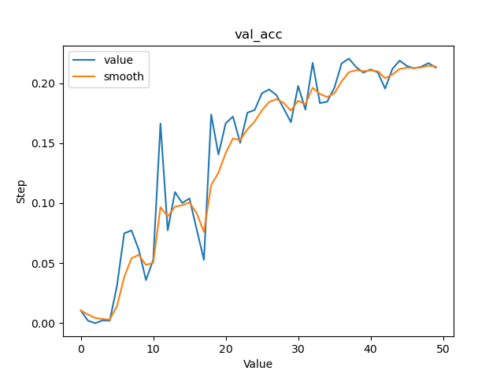
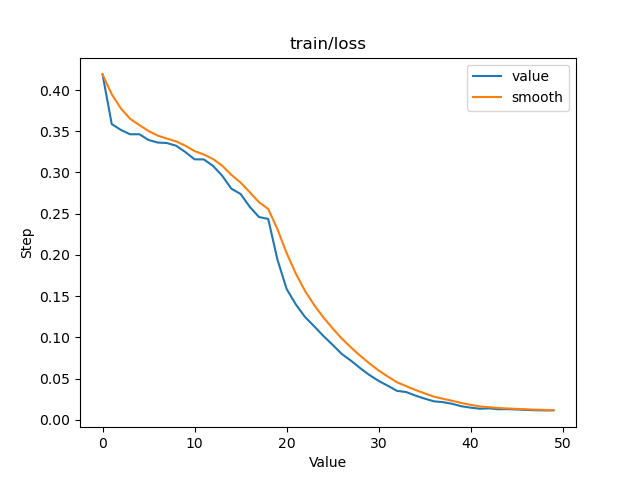
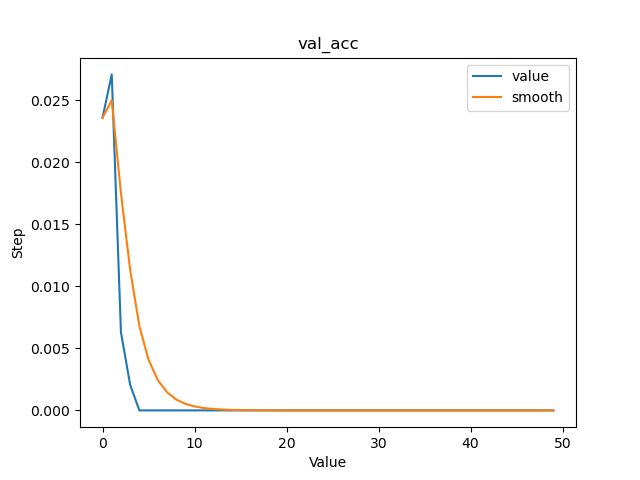
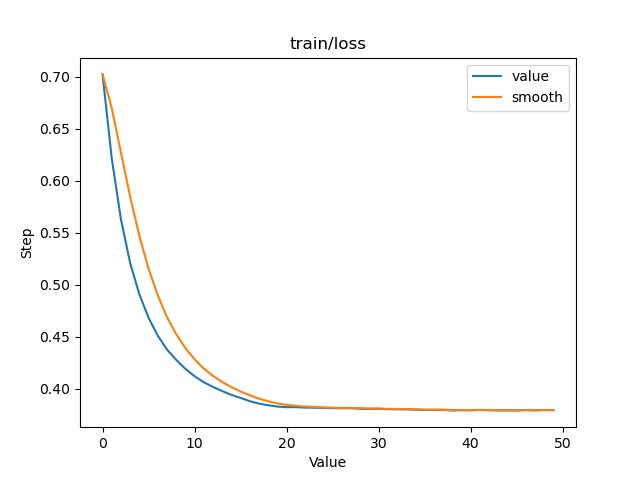
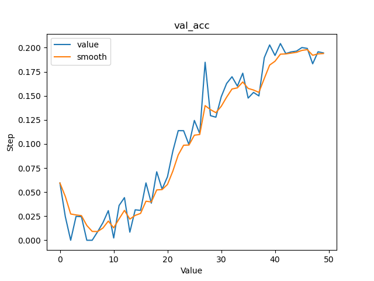
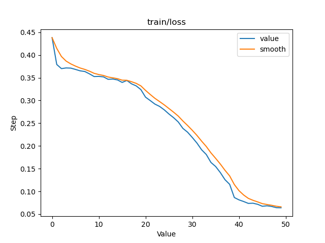

# KERIS_AI_hackathon_recycle_challenge
"Naver Smart Machine Learning Platform(NSML)을 이용하여 실제 인공지능 개발을 참여하는 AI 해커톤" 입니다.

### 문제
이곳에는 "본선 AI 문제" 에 대한 지금까지 연구했던 레포들을 모아놓았습니다.
* **연습용 AI 문제 : 영화 평점 예측문제** 
시놉시스, 감독, 배우 등 영화와 관련된 여러 데이터를 이용하여 곧 개봉 될 영화의 평점을 예측해보는 문제입니다.

* **본선 AI 문제 : 생활 폐기물 이미지 분류** 
이미지 분류 알고리즘을 통해 생활 폐기물 이미지를 분류하는 인공지능 알고리즘 개발하는 것입니다.

### 리더보드
[링크](https://ai.nsml.navercorp.com/ranking)를 눌러서 실시간으로 확인해 보세요!

## 폴더별 솔루션 내역
아래의 내용은 현 레포에 대해 어떻게 개선했고 어떻게 보완해 갔는지에 대해 서술 되어 있습니다. 
추후 솔류션별 결과도 공개하도록 하겠습니다.

초반부에는 Adam 모듈에서 여러 optimizer를 시도해 보았습니다. 
중반부부터 학습횟수를 증가시켰으며, betch_size, layer 등 개선해나가기 시작했습니다.
### [KERIS014_recycle_challenge_2](KERIS014_recycle_challenge_2)
 

생활 폐기물 이미지 분류하는 인공지능 알고리즘의 베이스 코드입니다. [원본](https://github.com/keris2020/hackathon/tree/main/recycle_challenge)

### [KERIS014_recycle_challenge_5](KERIS014_recycle_challenge_5)
 
optimizer를 기본 Adam에서 SDG로 교체해 보았습니다.

### [KERIS014_recycle_challenge_8](KERIS014_recycle_challenge_8)
 
optimizer를 기본 SDG에서 RMSprop로 교체해 보았습니다.

### [KERIS014_recycle_challenge_9](KERIS014_recycle_challenge_9)
optimizer를 기본 RMSprop에서 Adagrad로 교체해 보았습니다.

### [KERIS014_recycle_challenge_17](KERIS014_recycle_challenge_17)
optimizer를 Adagard에서 기본적인 모듈인 Adam으로 다시 돌려보았습니다.

### [KERIS014_recycle_challenge_22](KERIS014_recycle_challenge_22)
optimizer를 AdamW로 교체하고 학습률을 epochs 300회로 높인 뒤 layers 값을 [3,4,6,3] (34-layers)로 상향하였습니다.

### [KERIS014_recycle_challenge_26](KERIS014_recycle_challenge_26)
사진 크기를 Resize를 통해 (224, 224)에서 (448, 448)로 높혔습니다. , lr_scheduler를 StepLR 대신 ReduceLROnPlateau를 사용하였습니다.

### [KERIS014_recycle_challenge_3
또한, 목요일날 진행한 특강을 반영하였습니다.

### [KERIS014_recycle_challenge_5<img src="KERIS014_recycle_challenge_51)
37번과 같은 코드입니다. 작동 도중에 중단하여 재작동 하였습니다.

### [KERIS014_recycle_challenge_53](KERIS014_recycle_challenge_53)
목요일날 진행한 특강을 반영하였습니다. 대신 AdamW를 대신에 AdamP를 기반으로 고쳐보았습니다.

### [KERIS014_recycle_challenge_66](KERIS014_recycle_challenge_66)
기존 31번를 개선하고 AdamW를 기반으로 다시 돌리게 되었습니다. 또한 통계에 러닝레이트를 추가하게 되었습니다.

### [KERIS014_recycle_challenge_68](KERIS014_recycle_challenge_68)
기존 31번를 개선하고 AdamP를 기반으로 다시 돌리게 되었습니다. 또한 통계에 러닝레이트를 추가하게 되었습니다.
